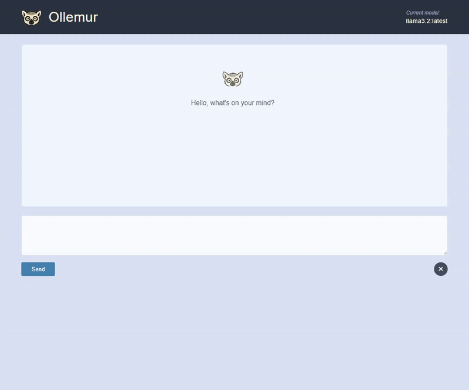

# Ollemur

Ollemur (pronounced "oh-[lemur](https://en.wikipedia.org/wiki/Lemur)") is my attempt at creating a web frontend for LLMs running via [Ollama](https://ollama.com/). By default, Ollama prints LLM responses right in your terminal, which is great, but becomes strenuous to read and sort through. Ollemur provides a simple frontend with markdown rendering so that the chat bot responses are easier to read and interact with.

## How to Use

You have to have Ollama installed to run Ollemur. In the future, I hope to streamline this:

- Ollama must be running at: `http://localhost:11434` (that's where it should run by default)
- `cd` into the app's folder and run `npm run start` - this should start the parcel server at `http://localhost:1234`
- This app currently uses the `gemma3:4b` LLM, so that will need to be installed via Ollama.
- Once both of those localhosts are running, you should be able to interact with the chatbot at `http://localhost:1234`

## Dev Notes

- `npm run build` to build/minify the app files, tree-shake unused code, compress assets and hash filenames for cache busting - also runs `format`.
- `npm run format` to format all files with Prettier.
- `npm run start` to start the dev server
